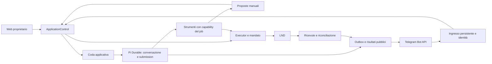

# Architettura Pi usata da SatsSurge

## Componenti diversi, API diverse

| Componente | Responsabilità | Contratto importante |
|---|---|---|
| `pi-ai` | Modelli, provider, credenziali, OAuth, protocolli di streaming e tool call | Non possiede la coda o le autorizzazioni finanziarie dell'app |
| `pi-agent-core` | Loop dell'agente e stato/eventi in memoria | La persistenza canonica resta responsabilità dell'host |
| `pi-coding-agent` | Host CLI/TUI, SDK di sessione e caricamento delle estensioni | `ExtensionAPI`, `registerTool`, `registerCommand`, `pi.on` |
| `pi-durable` | Conversazioni, submission, task, documenti e recovery persistenti | `Harness`, registry, `defineTool`, `defineExtension`, hook e task |
| `chord` | Stato strutturato, commit, transazioni e contesti sottostanti | Primitivi condivisi; non un secondo agente |

SatsSurge dipende direttamente da `@earendil-works/pi-ai`,
`@earendil-works/pi-durable` e `@earendil-works/chord`, fissati a **1.1.0**.
Non incorpora Pi Coding Agent: le sue guide sono conservate per comprendere
l'ecosistema e la portabilità dei plugin, non per usare quelle API nel nostro
harness. Gli esempi vecchi con namespace `@mariozechner/*` vanno valutati per
API e versione, non adattati cambiando solamente il nome dell'import.

## Proprietà applicativa

La freccia strumenti → Executor è disponibile soltanto ai job autorizzati
all'esecuzione finanziaria. Le conversazioni Telegram sono di sola lettura o
abilitate a creare proposte manuali; non acquisiscono quel permesso dal testo.
L'approvazione consumata permette la valutazione della proposta, mai il
superamento di mandato, riserve o controlli di integrità.

Le dipendenze verso le altre app Lightning di Umbrel appartengono alla fase
successiva di autosufficienza. Questo rilascio Telegram non le elimina e non
introduce aperture/chiusure di canali, RoboSats, swaps o mercati di liquidità.

## Tre domini di persistenza locali

- `operational.sqlite`: coda, capability, evidenze, decisioni, operazioni,
  prenotazioni, contabilità, proposte e stato Telegram.
- `durable.sqlite`: conversazioni, submission e task Pi Durable.
- `oauth.sqlite`: credenziali e stato OAuth gestiti dall'adattatore dedicato.

Una transazione non copre insieme questi database o un'API esterna. La
correlazione esplicita degli ID collega i domini: `requestId`, job,
conversation/submission, proposta, decisione, operazione e payment hash.
Per una ripresa usare gli identificatori originali, non creare una nuova
submission per un job che ne possiede già una.

## Dove leggere il codice

- [Agente e harness](../../whirmill-satssurge-autopilot/src/agent.ts): provider,
  registry, selezione tool, storage FULL e proiezione degli eventi.
- [Controlli condivisi](../../whirmill-satssurge-autopilot/src/application-control.ts):
  ammissione, pausa/ripresa e approvazioni.
- [Executor](../../whirmill-satssurge-autopilot/src/executor.ts): prenotazione,
  intento, invio e riconciliazione.

Il codice e i test applicativi sono la verità sul comportamento di SatsSurge;
gli snapshot upstream spiegano i primitivi su cui si basa.
